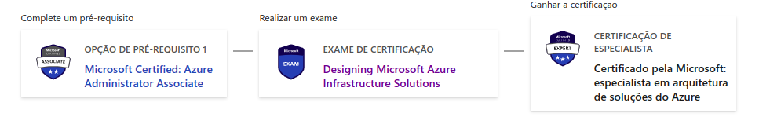

# Plano de Estudo sobre a certificação Designing Microsoft Azure Infrastructure Solutions

### Objetivo de aprendizagem

Adquirir o conhecimento necessário para obter a certificação AZ 305 Designing Microsoft Azure Infrastructure Solutions

A preparação e a obtenção desta certificação demonstrarão:

- Criar soluções de identidade, governança e monitoramento 
- Elaborar soluções de armazenamento de dados 
- Criar soluções de continuidade dos negócios 
- Criar soluções de infraestrutura 

### palavras chaves

- Azure Monitor
- Azure Data Explorer
- Azure Insights
- Azure Active Directory
- IAM
- Azure Key Vault
- Grupos de recursos
- Azure Blueprints
- Assinaturas do Azure
- Zonas de destino do Azure
- SQL do Azure
- Instancia gerencia do SQL do Azure
- Escalabilidade
- Disponibilidade
- Azure Cosmos DB
- Armazenamento de tabelas do Azure
- Azure Data Factory
- Azure Data Lake
- Azure Data Bricks
- Azure Synapse Analytics
- Azure Stream Analytics 
- Migração
- Alta disponibilidade
- Backup do Azure
- Blobs do Azure
- Azure Site recovery
- Azure Front Door
- Gerenciador de Tráfego do Azure
- Serviço de Computação do Azure
- Máquinas Virtuais do Azure
- Lote do Azure
- Serviço de aplicativo do Azure
- Instancias de container do Azure
- Serviço de Kubernetes do Azure
- Azure Functions
- Aplicativos lógicos do Azure
- Hubs de eventos do Azure
- Caching
- Integração de API
- Microsoft Cloud Adoption Framework para o Azure
- Redes virtuais do Azure
  
### Onde pesquisar

- Site oficial do learn microsoft
- Udemy
- Google
- Simulados

### Explorar o tema

Os candidatos deste exame devem ter experiência e conhecimento avançados de TI, incluindo rede, virtualização, identidade, segurança, continuidade de negócios, recuperação de desastres, gerenciamento de dados, orçamento e governança. Um profissional nessa função deve gerenciar como as decisões em cada área afetam uma solução geral. Além disso, deve ter experiência na administração e no desenvolvimento do Azure, bem como em processos de DevOps.

Obter essa certificação habilita o estudante a posse de uma certificação nível Especialista: "Especialista em arquitetura de soluções do Azure. 

Para isso é necessário passar no exame 305 e possuir a certificação [AZ104 Azure Administrator Associate](https://learn.microsoft.com/pt-br/certifications/azure-administrator/). A mecânica é essa:

O link para conferir o path das certificações acima é este [aqui](https://learn.microsoft.com/pt-br/certifications/azure-solutions-architect/)

- Duração: 120 minutos
- Custo: 100USD
- Formato: 40 a 60 perguntas
- Pontuação: 700 (Pontuação de 1 a 1000)

A prova é dividida em domínios:

- Criar soluções de identidade, governança e monitoramento

  - Criar uma solução para registrar e monitorar os recursos do Azure
	- Projetar soluções de autenticação e autorização
  - Projetar governança

  	- Tópicos chave:
  
  		- Azure Monitor
  		- Azure Data Explorer
  		- Azure Insights
  		- Azure Active Directory
  		- IAM
  		- Azure Key Vault
  		- Grupos de recursos
  		- Azure Blueprints
  		- Assinaturas do Azure
  		- Zonas de destino do Azure

- Elaborar soluções de armazenamento de dados

	- Criar uma solução de armazenamento de dados para dados relacionais  		
	- Criar uma solução de armazenamento de dados para dados não relacionais
  - Elaborar integração de dados
  
  	- Tópicos chave:
  
  		- SQL do Azure
  		- Instancia gerencia do SQL do Azure
  		- Escalabilidade
  		- Disponibilidade
  		- Azure Cosmos DB
  		- Armazenamento de tabelas do Azure
  		- Azure Data Factory
  		- Azure Data Lake
  		- Azure Data Bricks
  		- Azure Synapse Analytics
  		- Azure Stream Analytics
  
- Elaborar soluções de continuidade dos negócios
  
  - Criar uma solução para backup e recuperação de desastre
  - Projetando para a alta disponibilidade

  	- Tópicos chave:

  		- Backup do Azure
  		- Blobs do Azure
  		- Azure Site recovery
  		- Azure Front Door
  		- Gerenciador de Tráfego do Azure
  
- Criar soluções de infraestrutura

  - Criar uma solução de computação do Azure
  - Criar uma arquitetura de aplicativo
  - Projetar migrações
  - Projetar soluções de rede

  	- Tópicos chave:
  
  		- Serviço de Computação do Azure
  		- Máquinas Virtuais do Azure
  		- Lote do Azure
  		- Serviço de aplicativo do Azure
  		- Instancias de container do Azure
  		- Serviço de Kubernetes do Azure
  		- Azure Functions
  		- Aplicativos lógicos do Azure
  		- Hubs de eventos do Azure
  		- Caching
  		- Integração de API
  		- Microsoft Cloud Adoption Framework para o Azure
			- Redes virtuais do Azure
  
Aqui reside a doc oficial sobre a certificação, com todo material sobre, incluindo a opção de agendar o exame:

https://learn.microsoft.com/pt-br/certifications/exams/az-305

### Ao agendar o exame

Se cadastre com os dados iguais a de seu documento (RG, Habilitação, Passaporte, etc)

O exame é oferecido através da plataforma da pearsonvue, nela é possível executar um teste no pc que será utilizado para realizar a prova, em termos gerais não somente para a webassessor mas qualquer teste online:

- Deixe o ambiente iluminado.
- Vá ao banheiro antes.
- Deixe a mesa limpa, se possível sem monitores, cabos, teclados, etc.
- Documento com identificação com fácil acesso.
- Se for utilizar a camera integrada do notebook e ele estiver conectado utilizando um cabo de rede, tome cuidado para não desconectar o cabo ou qualquer outro tipo de problema.
- Se o seu inglês ou espanhol não estiver na sua melhor versão, explique via chat e peça para o inspetor digitar as perguntas, geralmente ele pede para olhar os quatros cantos do cômodo que está fazendo a prova e embaixo da mesa.
- Atente-se ao fuso horário na hora de agendar a prova
- Fique calmo que vai dar certo.

### Como se preparar para o exame

Aqui vai de como o estudante se sente em frente ao exame. Uma boa opção é se testar frente a um simulado e o resultado pode indicar a quantidade e ordem de material a ser estudado. 

Em todo caso, consumir o curso e as documentações antes do simulado pode ser uma boa.

### Cursos

#### Learn Microsoft

- A plataforma [learn](https://learn.microsoft.com/) da Microsoft oferece todo o necessário para o exame no formato de roteiro, de graça:

Link: https://learn.microsoft.com/pt-br/certifications/exams/az-305

O roteiro está aqui:

[Pré-requisitos do Microsoft Azure Architect Design](https://learn.microsoft.com/pt-br/training/paths/microsoft-azure-architect-design-prerequisites/)

[Criar soluções de identidade, governança e monitoramento](https://learn.microsoft.com/pt-br/training/paths/design-identity-governance-monitor-solutions/)

[elaborar soluções de continuidade dos negócios](https://learn.microsoft.com/pt-br/training/paths/design-business-continuity-solutions/)

[elaborar soluções de armazenamento de dados](https://learn.microsoft.com/pt-br/training/paths/design-data-storage-solutions/)

[Criar soluções de infraestrutura](https://learn.microsoft.com/pt-br/training/paths/design-infranstructure-solutions/)

[Crie ótimas soluções com a estrutura bem arquitetada do Microsoft Azure](https://learn.microsoft.com/pt-br/training/paths/azure-well-architected-framework/)

[Acelere a adoção da nuvem com o Cloud Adoption Framework para Azure](https://learn.microsoft.com/pt-br/training/paths/cloud-adoption-framework/)

#### Exam Readiness

- A microsoft oferece um conjunto de vídeos preparatórios para a certificação com o Exam Readiness, vale muito a pena:

O Readiness fica aqui: https://learn.microsoft.com/pt-br/shows/exam-readiness-zone/

Os vídeos estão aqui:

https://learn.microsoft.com/pt-br/shows/exam-readiness-zone/preparing-for-az-305-design-identity-governance-and-monitoring-solutions-segment-1-of-4/

https://learn.microsoft.com/pt-br/shows/exam-readiness-zone/preparing-for-az-305-design-data-storage-solutions-segment-2-of-4/

https://learn.microsoft.com/pt-br/shows/exam-readiness-zone/preparing-for-az-305-design-business-continuity-solutions-segment-3-of-4/

https://learn.microsoft.com/pt-br/shows/exam-readiness-zone/preparing-for-az-305-design-infrastructure-solutions-segment-4-of-4/

#### Simulados

- Simulado Designing Azure Infrastructure Solutions Exam 2022, da Cloud Connect em inglês.

Classificação: 4,4 de 5 (751 classificações) e 7.895 alunos

Link: https://www.udemy.com/course/az-304-microsoft-azure-architect-design-exam-practice-tests/

Simulado com um total de 323 perguntas com tempo (para se aproximar do exame).

Durante as promoções na Udemy, é possível comprar esse curso por cerca de R$22,90.

- Simulado AZ-305 Designing MS Azure Infrastructure Sols Practice Tests, do Ameya Hannah em inglês.

Classificação: 4,4 de 5 (37 classificações) e 382 alunos

Link: https://www.udemy.com/course/az-305-designing-ms-azure-infrastructure-solutions-practice-test/

Simulado com um total de 243 perguntas com tempo (para se aproximar do exame).

Durante as promoções na Udemy, é possível comprar esse curso por cerca de R$22,90.

### Acesso a console

Ter acesso a uma conta ajuda bastante, é possível verificar fluxos de criação de recursos, como por exemplo criação de uma máquinas virtuais, vpc sem gerar custo e isso pode ajudar muito durante o exame. Ainda é possível criar uma conta 
com nível gratuito e testar recursos por 12 meses.

*Para evitar gastos, lembre-se sempre de excluir tudo o que for criado.*

### Documentação

Alguns links que conversam diretamente com os dominios cobrados no exame:

[Visão geral da segurança de gerenciamento de identidade do Azure](https://learn.microsoft.com/pt-br/azure/security/fundamentals/identity-management-overview)

[Armazenamento](https://azure.microsoft.com/pt-br/products/category/storage)

[Criar soluções de continuidade de negócios e recuperação de desastre com Azure Data Explorer](https://learn.microsoft.com/pt-br/azure/data-explorer/business-continuity-create-solution)

[Dez princípios de design para aplicativos do Azure](https://learn.microsoft.com/en-us/azure/architecture/guide/design-principles/)

### Como você pode recuperar ?

Escrever resumo sobre os tópicos chave e ou serviços abordados e compara-los com demais cloud providers

Fazer um video rápido para youtube sobre tópicos chaves e ou serviços abordados

## Valide seu conhecimento

Um bom score nos simulados pode dar uma boa pista de como está o entendimento sobre os domínios.

### Investigação de contexto

### Pessoas que são autoridade sobre o tema

- Arquitetos de soluções
- Devops/Sre's
- Pessoas já certificadas

### Fontes de consumo fácil

Criar soluções de identidade, governança e monitoramento:

[Se você já conhece outro provedor (azure, aws) esse comparativo de serviços pode ajudar a fazer um "de para"](https://www.techtarget.com/searchcloudcomputing/feature/A-cloud-services-cheat-sheet-for-AWS-Azure-and-Google-Cloud)

[Guia de estudos oficial da MS para o exame](https://query.prod.cms.rt.microsoft.com/cms/api/am/binary/RWLFRU)

[Azure Well Architected](https://azure.microsoft.com/pt-br/solutions/cloud-enablement/well-architected/#overview)
